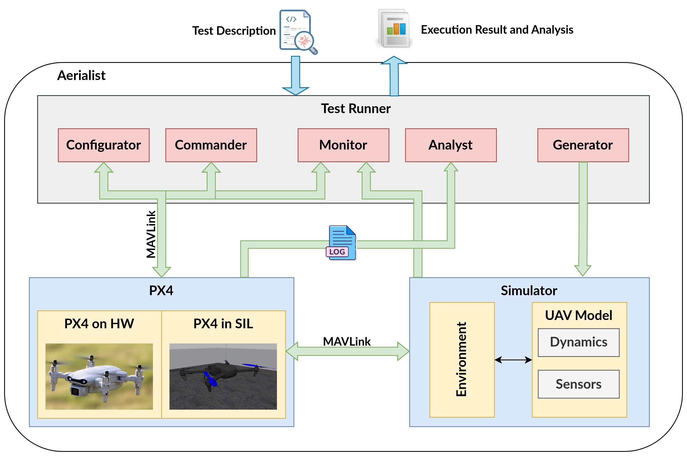
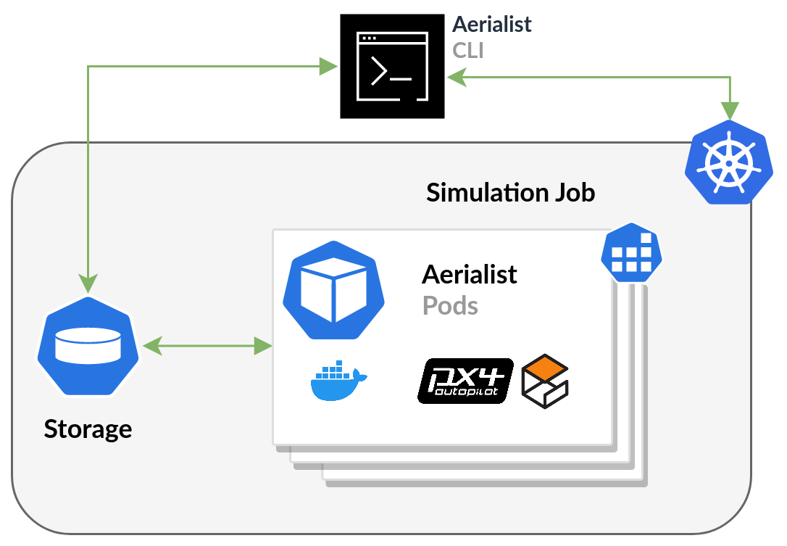
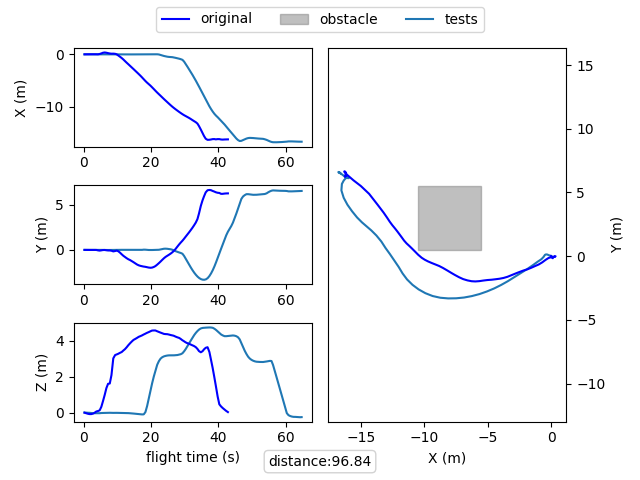

# AERIALIST: UAV Test Bench

<!-- ## [Demo Video](https://youtu.be/pmBspS2EiGg) -->

**Aerialist** (unmanned AERIAL vehIcle teST bench) is a novel test bench for UAV software that automates all the necessary UAV testing steps: setting up the test environment, building and running the UAV firmware code, configuring the simulator with the simulated world properties, connecting the simulated UAV to the firmware and applying proper UAV configurations at startup, scheduling and executing runtime commands, monitoring the UAV at runtime for any issues, and extracting the flight log file after the test completion.

With Aerialist, we aim to provide researchers with an easy platform to automate tests on both simulated and real UAVs, allowing them to do experiments required to overcome the UAV simulation-based testing challenges.

## Table of Contents

- [Introduction](#introduction)
  - [UAV Tests](#uav-tests)
  - [Demo Video](#demo-video)
- [Getting Started](#getting-started)
  - [Docker Test Execution](#docker-test-execution)
  - [Local Test Execution](#local-test-execution)
  - [Kubernetes Test Execution](#kubernetes-test-execution)
- [Usage](#usage)
  - [Test Description File](#test-description-file)
  - [Command Line Interface](#command-line-interface)
  - [Python API](#using-aerialist-in-your-code)
- [References](#references)
<!-- - [Contributing](#contributing) -->
- [License](#license)
- [Contacts](#contacts)

## Introduction
<!-- **Aerialist** (unmanned AERIAL vehIcle teST bench) is a modular and extensible test bench for UAV software and it aims to facilitate and automate all the necessary steps of definition, generation, execution, and analysis of system-level test cases for UAVs. -->
The below figure demonstrates Aerialist's software architecture, with the current implementation supporting UAVs powered by [PX4-Autopilot](https://github.com/PX4/PX4-Autopilot) (a widely used open-source UAV firmware).

The input is a [**Test Description**](#test-description-file) file, which defines the UAV and environment configurations and the test steps.
The **Test Runner** subsystem (that abstracts any dependencies to the actual UAV, its software platform, and the simulation environment) prepares the environment for running the test case as described in the test description.  
After setting up the simulation environment (if testing a simulated UAV), the Test Runner connects to the (simulated or physical) UAV and configures it according to the startup instructions. Then, it sends runtime commands, monitors the UAV's state during the flight, and extracts flight logs at the end of the test for future analysis. Each module is detailed in the [Architecture Documents](docs/architecture.md).



### UAV Tests

The de-facto testing standard of UAVs relies on *manually written system-level tests* to test UAVs *in the field*.
These tests are defined as **software configurations** (using parameters, config files, etc.) in a specific **environment** setup (e.g., obstacles placement, lighting conditions) and a set of runtime **commands**.
The runtime commands received during the UAV flight (e.g., from a remote controller) make the UAV fly with a specific human observable **behavior** (e.g., trajectory, speed, distance to obstacles).

Hence, Aerialist models a UAV test case with the following set of *test properties* and uses a *YAML* structure to describe the test.

- **Drone**: Software configurations of the UAV model, including all [Autopilot parameters](https://docs.px4.io/main/en/advanced_config/parameter_reference.html) and configuration files (e.g., mission plan) required to set up the drone for the test.

- **Environment**: Simulation settings such as the used simulator, physics of the simulated UAV, simulation world (e.g., surface material, UAV’s initial position), surrounding objects (e.g., obstacles size, position), weather conditions (e.g., wind, lighting), etc.

- **Commands**: Timestamped external commands from the ground control station (GCS) or the remote controller (RC) to the UAV during the flight (e.g., change  flight mode, go in a specific direction, enter mission mode).

- **Expectation (optional)**: a time series of certain sensor readings that the test flights are expected to follow closely.

### Demo Video

Take a look at the [Demo Video](https://youtu.be/cIeUN8f00L0) to get more insights on the test execution methods introduced later.

[](https://www.youtube.com/watch?v=cIeUN8f00L0)

## Getting Started

You can execute UAV test cases with Aerialist in three different ways.

- [Docker Test Execution](#docker-test-execution) (**Recommended**): Execute Test Cases in pre-built Docker containers without the need to install PX4 dependencies on your machine.
This is the recommended option for most use cases and supports headless simulation (without the graphical interface).

- [Local Test Execution](#local-test-execution): Execute Test Cases using PX4 dependencies installed on the same machine.
This allows you to easily develop new functionalities and run the UAV simulators with the graphical interface so you can visually follow the UAV behavior.
This is only recommended if you prefer to get more insights into UAV behavior.

- [Kubernetes Test Execution](#kubernetes-test-execution): You can also deploy your test execution to a Kubernetes cluster for more scale.
This option is only recommended if you are using Aerialist to conduct large-scale experiments on test generation for drones.

### Docker Test Execution

Using Docker containers with pre-configured PX4 dependencies to execute test cases is the simplest and recommended way of executing UAV tests with Aerialist.
Aerialist's Docker image is hosted on [Dockerhub](https://hub.docker.com/r/skhatiri/aerialist).

#### Using Docker Container's CLI

- Requirements: [Docker](https://docs.docker.com/engine/install/)
- This has been tested on **Windows, Ubuntu and macOS with x86-64 processors**.
  - You may need to rebuild the docker image if you are using another OS or architecture.

1. `docker run -it skhatiri/aerialist bash`

- You can now use the [Command Line Interface](#command-line-interface) in the container's bash.
- check `python3 aerialist exec --help`

**Note:** The .env for the docker image comes from [template.env](template.env). You can customize them using [environment variables](https://docs.docker.com/engine/reference/commandline/run/#env) for the Docker container.

#### Using Host's CLI

Alternatively, you can use the CLI on your local machine and instruct Aerialist to execute test cases inside a docker container.
This gives you more flexibility since the test results (flight logs) are directly stored on the host machine and you don't lose them.

- Requirements:
  - [Docker](https://docs.docker.com/engine/install/)
  - Python ≥ 3.8
  - Your user should be able to run docker commands without `sudo`. [check here](https://docs.docker.com/engine/install/linux-postinstall/)
- This has been tested on **Ubuntu and macOS with x86-64 processors**.
  - You may need to rebuild the docker image if you are using another OS or architecture.

1. Clone this repository and `cd` into its root directory
2. `pip3 install -r requiremetns.txt`
3. Create a file named `.env` in the repository's root directory. Then copy and customize the contents of [`template.env`](template.env) into it.
4. Create a folder named `results` in the repository's root directory.
5. You can use the dockerfile to build a Docker image with all the requirements, or instead pull the latest image from the Image repository.

- `docker build . -t skhatiri/aerialist`
- or `docker pull skhatiri/aerialist`

6. You can now instruct Aerialist to execute test cases inside a docker container

- Just add `--agent docker` to the command line or update the test-description file (`agent.engine:docker`).
- You can now use the [Command Line Interface](#command-line-interface) in your local bash.
  - check `python3 aerialist exec --help`

### Local Test Execution

**Note:** Installing [PX4-Autopilot](https://github.com/PX4/PX4-Autopilot), [PX4-Avoidance](https://github.com/PX4/PX4-Avoidance) and their requirements including ROS and Gazebo could be problematic in many cases. We only suggest this full installation to users who need direct visual access to the simulator or are curious to visually monitor the UAVs during the flight. Otherwise, test execution, extracting the flight logs, and plotting them can be achieved by the [docker exection](#docker-test-execution) as well.

- We have prepared a ready-to-use virtual machine ([download link](https://zhaw-my.sharepoint.com/:f:/g/personal/mazr_zhaw_ch/EnxLqlyju6RMhUYV_SXTqBEBfxundq_-X67eRQAwCPjHvg?e=9953JZ)) to help users onboaord fast. You can move on to using [dockerized test executions](#docker-test-execution) if you don't need the simulation visualizations any more.

If you prefer to run the simulations and PX4 on your own machine, follow [PX4 installation guide](./docs/PX4_installation.md).

- Requirements:
  - **Ubuntu 18**

1. We have prepared a [bashsript](./setup_script/full_setup.sh) to automate all the steps of installing PX4 and Aerialist in one shot. [Follow the instructions](./docs/PX4_installation.md#instalation-using-bash-script).

- You can also follow a [step-by-step guide](./docs/PX4_installation.md#step-by-step-instlation) if needed.

2. Clone this repository and cd into its root directory
3. `pip3 install -r requiremetns.txt`
4. Create a file named `.env` in the repository's root directory. Then copy and customize the contents of [`template.env`](template.env) into it.

- Update *PX4_HOME* and *RESULTS_DIR* variables according to your installation.

5. You can now use the [Command Line Interface](#command-line-interface).

### Kubernetes Test Execution

Aerialist can also deploy test executions on a Kubernetes cluster to facilitate running tests in the cloud. Specifically, as can be seen in the below figure, Aerialist can run multiple executions of the same test case in isolated Kubernets pods in parallel, and gather test results for further processing.

This feature is specifically helpful when performing test generation tasks, where UAV's flight could be subject to non-determinism and multiple simulations are required.
Follow our [K8S Deployment Guideline](./docs/k8s_setup.md).  

<!-- 
<p align="center"></p>
Aerialist can connect both to a cloud Kubernetes cluster, or a local instance (more useful during development).

- Requirements:
  - [kubectl](https://kubernetes.io/docs/tasks/tools/#kubectl)
    - [Set default context and namespace](https://kubernetes.io/docs/reference/kubectl/cheatsheet/#kubectl-context-and-configuration) to your prefered clster and namespace if needed
  - [yq](https://github.com/mikefarah/yq#install)

      ```bash
      wget https://github.com/mikefarah/yq/releases/download/v4.22.1/yq_linux_amd64 -O /usr/bin/yq &&\
          chmod +x /usr/bin/yq
      ```

#### Using Local Kubernetes Instance

**TODO**

#### Using Cloud Kubernetes Cluster

Aerialist uses a [NextCloud](https://nextcloud.com/) instance to share files between the main container, and the parallel test executers. You can get a free account in [a cloud provider](https://nextcloud.com/sign-up/) or deploy your own [dockerized instance](https://hub.docker.com/_/nextcloud).

1. Set your NextCloud credentials and address in as a k8s-Secret:
  `kubectl create secret generic webdav --from-literal=host=https://[your-nextcloud-address]/remote.php/dav/files/[your-account-id]/ --from-literal=user=[username] --from-literal=pass=[password]`

2. Upload your [`k8s-config.yaml`](https://kubernetes.io/docs/concepts/configuration/organize-cluster-access-kubeconfig/) as a k8s-ConfigMap:
  `kubectl create configmap k8s-config --from-file k8s-config.yaml`

3. You can now use `--agent k8s` in the commands to run the simulations in your k8s-cluster.
  `python3 aerialist exec --test samples/tests/mission1.yaml --agent k8s -n 5 --id mission-test --path webdav://` -->

## Usage

### Test Description File

Using a predefined [test-description yaml file](samples/tests/template-test.yaml) is the easiest way to define the test case.

```yaml
# template-test.yaml
drone:
  port: sitl # type of the drone to connect to {sitl, ros, cf}
  #params: #PX4 parameters : https://docs.px4.io/main/en/advanced_config/parameter_reference.html
    # {parameter_name}: {parameter_value} #(keep datatype -> e.g, 1.0 for float, 1 for int)
    # CP_DIST: 1.0
    # POS_MOD: 2.5
  params_file: samples/flights/mission1-params.csv #csv file with the same structure as above 
  mission_file: samples/flights/mission1.plan # input mission file address

simulation:
  simulator: ros # the simulator environment to run {gazebo,jmavsim,ros} 
  speed: 1 # the simulator speed relative to real time
  headless: true # whether to run the simulator headless
  obstacles:
  - size: # Object 1 size in l,w,h
      l: 5
      w: 5
      h: 5
    position: # Object 1 position in x,y,z and it's rotation
      x: -8
      y: 3
      z: 0
      r: 0
  # home_position: # home position to place the drone [lat,lon,alt]  
test:
  commands_file: samples/flights/mission1-commands.csv # runtime commands file address

assertion:
  log_file: samples/flights/mission1.ulg # reference log file address
  # variable: trajectory # reference variables to compare 

```

### Command-Line Interface

#### Test Execution

You can utilize the toolkit with the following command line options:

1. Make sure you are at the root directory of the repository:
`cd Aerialist/`

2. **IMPORTANT NOTE**: The following commands are assuming that you are using Aerialist directly on your machine (not inside a docker container).

- `--agent docker` is asking Aerialist to create a docker container and execute test cases there as detailed [above](#using-hosts-cli).
- If you are executing the command [inside a docker container](#using-docker-containers-cli), exclude `--agent docker` to let the test run locally there.

3. The simplest way to execute a UAV test by Aerialist is by the following command:

    `python3 aerialsit exec --test [test-file.yaml] --agent docker`

- Replaying a pre-recorded manual flight (RC commands are extracted and replayed from a .ulg log)

  `python3 aerialist exec --test samples/tests/manual1.yaml --agent docker`

- Executing an autonomous mission with a box-shaped obstacle in the environment

  `python3 aerialist exec --test samples/tests/mission1.yaml --agent docker`

- More sample tests can be found [here](samples/tests/)

4. When test exection is finished, you will have test results in `results/` folder:

- Flight Log of the executed test (.ulg)
- Plot of the flight trajectory, as seen below

You can use `python3 aerialist exec --help` anywhere to get help on [other possible arguments](./docs/CLI.md).

#### Plotting Executed Test Cases

You can plot flight trajectory of the executed test cases using the following comnmand. plots are stored in `results/` folder.

  `python3 aerialist plot --test [test-file.yaml] --log [test-log.ulg]`

<p align="center"></p>

### Using Aerialist in Your Code

You can integrate Aerialist's Python package in your own code and directly define and execute UAV test cases with it.
This can be specifically useful when you are working on test generation approaches for UAVs. An example of such usage of Aerialist can be found in [Surrealist](https://github.com/skhatiri/Surrealist).

1. `pip3 install git+https://github.com/skhatiri/Aerialist.git`
2. Create an instance of [DroneTest](./aerialist/px4/drone_test.py) class and define your test case
3. configure and execute the test case using your preferred test execution agent ([LocalAgent](./aerialist/px4/local_agent.py), [DockerAgent](./aerialist/px4/docker_agent.py), [K8sAgent](./aerialist/px4/k8s_agent.py))

- Take a look at our [code snippets](./samples/snippets/) for more details and sample codes.

## References

If you use this tool in your research, please cite the following papers:

- **Sajad Khatiri**, Sebastiano Panichella, and Paolo Tonella, "Simulation-based Test Case Generation for Unmanned Aerial Vehicles in the Neighborhood of Real Flights," *In 2023 IEEE 16th International Conference on Software Testing, Verification and Validation (ICST)*
  - [Preprint](https://skhatiri.ir/papers/surrealist.pdf)
  - [Experiments Dataset](https://doi.org/10.5281/zenodo.6525021)

````{code-block} bibtex
@inproceedings{khatiri2023simulation,
  title={Simulation-based test case generation for unmanned aerial vehicles in the neighborhood of real flights},
  author={Khatiri, Sajad and Panichella, Sebastiano and Tonella, Paolo},
  booktitle={2023 16th IEEE International Conference on Software Testing, Verification and Validation (ICST)},
  year={2023},
}
````

## License

The software we developed is distributed under MIT license. See the [license](./LICENSE.md) file.

## Contacts

Feel free to use the [Discussions](https://github.com/skhatiri/Aerialist/discussions) section to ask your questions and look for answers.

You can also contact us directly using email:

- Sajad Khatiri (Zurich University of Applied Sciences) - <mazr@zhaw.ch>

<!-- ## Contributing

TODO -->
